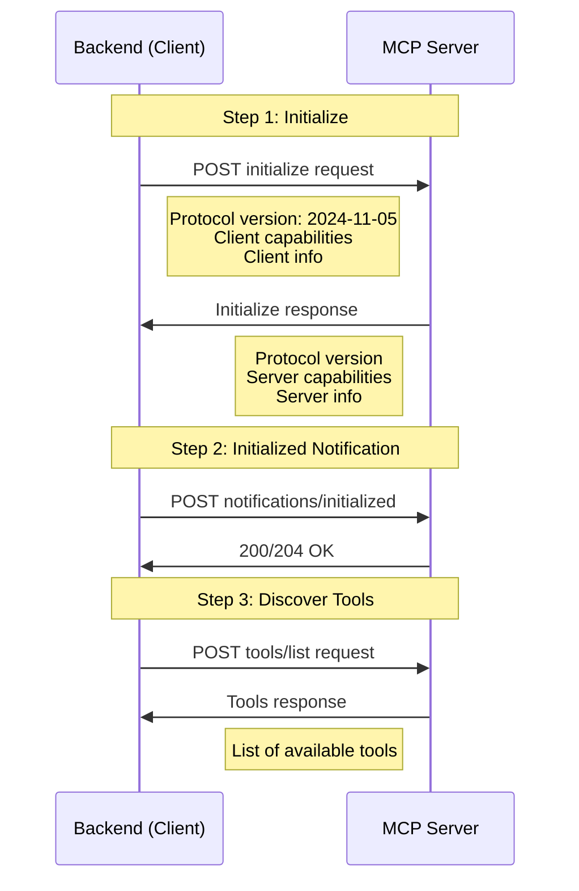

# MCP Lifecycle Implementation Walkthrough

## Summary

Successfully enhanced the MCP (Model Context Protocol) lifecycle implementation to fully comply with the [official MCP specification](https://modelcontextprotocol.io/specification/2025-11-25/basic/lifecycle). The implementation already followed the correct flow (initialize → initialized → tools/list), but has been improved with better compliance, validation, and error handling.

## Changes Made

### Backend Improvements

#### [mcp_servers.py](file:///c:/Users/opole/Downloads/ChatBotn/backend/app/routers/mcp_servers.py)

**1. Added Protocol Version Header**
- Added `MCP-Protocol-Version: 2024-11-05` header to all requests
- Complies with the MCP transport specification requirements

**2. Enhanced Response Validation**
- Validates the initialize response contains required fields:
  - `protocolVersion`
  - `capabilities`
  - `serverInfo`
- Better error detection and reporting

**3. Improved Error Messages**
- Added step indicators (step 1/4, 2/4, etc.) to error messages
- More descriptive error messages that specify which lifecycle phase failed
- Includes error codes from server responses
- Truncates long error messages to prevent overwhelming output

**4. Better Notification Handling**
- Validates the `initialized` notification response
- Accepts both 200 and 204 status codes (per spec)

**5. Enhanced Response Structure**
- Added `success` flag to response
- Includes `protocolVersion` in response
- Better structured `serverInfo` extraction

**6. New Endpoint Name**
- Created `/test-connection` endpoint (more descriptive)
- Maintained `/discover` endpoint for backward compatibility (redirects to new endpoint)

**7. Improved Documentation**
- Added link to official specification in docstring
- Clearer step-by-step documentation of the lifecycle flow

---

### Frontend Improvements

#### [mcp-servers-tab.tsx](file:///c:/Users/opole/Downloads/ChatBotn/frontend/src/components/settings/mcp-servers-tab.tsx)

**1. Updated API Endpoint**
- Changed from `/discover` to `/test-connection`

**2. Enhanced Success Message**
- Displays server name from `serverInfo`
- Shows protocol version
- Better formatted tool count display
- More informative success alert

---

## MCP Lifecycle Flow

The implementation follows this exact flow per the official specification:



### Example Request/Response

**Initialize Request:**
```json
{
  "jsonrpc": "2.0",
  "id": 1,
  "method": "initialize",
  "params": {
    "protocolVersion": "2024-11-05",
    "capabilities": {
      "roots": { "listChanged": true },
      "sampling": {},
      "tasks": { "requests": { "sampling": { "createMessage": {} } } }
    },
    "clientInfo": {
      "name": "ChatBotApp",
      "version": "1.0.0"
    }
  }
}
```

**Initialize Response (Expected):**
```json
{
  "jsonrpc": "2.0",
  "id": 1,
  "result": {
    "protocolVersion": "2024-11-05",
    "capabilities": { ... },
    "serverInfo": {
      "name": "ExampleServer",
      "version": "1.0.0"
    }
  }
}
```

---

## Testing

### Prerequisites

1. **MCP Server Running**: Ensure your MCP server is running (e.g., at `http://localhost:3004/`)
2. **Backend Server**: Backend should be running at `http://localhost:8000`
3. **Frontend Server**: Frontend should be running (typically at `http://localhost:3000`)

### Manual Testing Steps

1. **Start the Backend**:
```bash
cd backend
.venv\Scripts\activate  # Windows
uvicorn app.main:app --reload
```

2. **Start the Frontend**:
```bash
cd frontend
npm run dev
```

3. **Test the Connection**:
   - Navigate to **Settings → MCP Servers**
   - Click **"Test Connection"** on an existing MCP server
   - Expected result: Success message showing:
     - Server name
     - Protocol version
     - Number of tools discovered
     - List of first 10 tools

### Expected Success Message

```
✅ Connection successful!

Server: ExampleServer
Protocol: 2024-11-05

Found 5 tool(s):
- tool_1
- tool_2
- tool_3
- tool_4
- tool_5
```

### Testing Error Scenarios

**Scenario 1: Server Not Running**
- Expected: `Could not connect to MCP server at http://localhost:3004/. Please verify the URL and ensure the server is running.`

**Scenario 2: Invalid Response**
- Expected: `MCP initialization failed (step 1/4): Server response missing 'protocolVersion'`

**Scenario 3: Timeout**
- Expected: `Connection to MCP server timed out after 10 seconds. Please check if the server at http://localhost:3004/ is running.`

---

## Backward Compatibility

> [!IMPORTANT]
> The old `/discover` endpoint is maintained for backward compatibility. It now redirects to the new `/test-connection` endpoint, ensuring existing code continues to work.

---

## Validation Checklist

- ✅ Implements official MCP lifecycle specification
- ✅ Sends `initialize` request (not "discover")
- ✅ Includes `MCP-Protocol-Version` header
- ✅ Validates all required fields in initialize response
- ✅ Sends `initialized` notification
- ✅ Calls `tools/list` after initialization
- ✅ Provides clear error messages with step indicators
- ✅ Handles timeouts and connection errors gracefully
- ✅ Maintains backward compatibility
- ✅ Enhanced user-facing success messages

---

## Next Steps

To test with your MCP server at `http://localhost:3004/`:

1. Ensure the MCP server is running and accessible
2. Start the backend server
3. Navigate to Settings → MCP Servers in the UI
4. Click "Test Connection" on your configured MCP server
5. Verify you see the enhanced success message with server info

If you encounter any issues, the improved error messages will indicate exactly which step failed and why.
