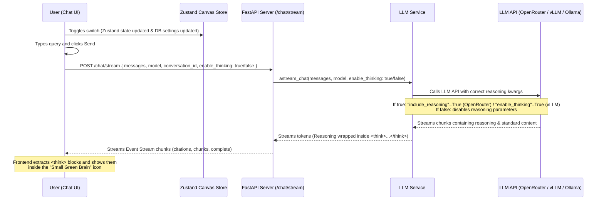

# Deep Thinking (LLM Reasoning Retrieval) Toggle System

This document describes the design, implementation, and state synchronization flow for the **Deep Thinking** switch feature in the Semantic Canvas.

---

## 1. Overview
The **Deep Thinking** toggle enables users to dynamically control whether the application requests and retrieves the deep reasoning/thinking process from reasoning-capable LLMs (like Qwen 32B, DeepSeek-R1, and other reasoning models).

Reasoning tokens are streamed within standard LLM outputs. Retrieving reasoning can significantly improve answer quality but might increase response latency. Toggling thinking off allows immediate, fast responses without reasoning steps.

---

## 2. Features & Architecture

### A. State Management
- **Zustand Canvas Store:** `enableThinking` and `setEnableThinking` are defined within `canvas-store.ts`.
- **Database Persistence:** The state is persistent in the `owner_config` field of the Canvas model in the database (`sql_app.db` under the key `enable_thinking`).
- **Synchronization Flow:**
  - On canvas loading (`loadCanvas` / `refreshThings`), `enableThinking` is initialized/synced from the database configuration (`canvas.owner_config.enable_thinking`).
  - When the user toggles the switch in either location, it calls `setEnableThinking(value)` and invokes `updateCanvasSettings({ enable_thinking: value })` to persist the setting in the backend.

### B. Dual-Switch UI Controls
The thinking switch is rendered in two intuitive locations:
1. **Top Panel Toolbar (`canvas-toolbar.tsx`):** Renders next to the LLM model selector with a sleek `<Sparkles>` icon, a label, and a switch.
2. **Chatbot Input Area (`conversation-viewer.tsx`):** Renders next to the voice mic button in the chat input bar as a premium `<BrainCircuit>` icon button. It highlights in **vibrant green** when deep thinking is enabled and fades to a neutral gray when disabled.

Toggling either of the switches instantly synchronizes the state of the other via the shared Zustand store.

---

## 3. Streaming and Parameter Mapping Flow

### Parameter Mapping on Providers
The backend `LLMService` maps the `enable_thinking` parameter to provider-specific arguments inside `_get_model`:

1. **OpenRouter:**
   - **Thinking Enabled:** Sets `extra_body["include_reasoning"] = True`
   - **Thinking Disabled:** Sets `extra_body["include_reasoning"] = False`
2. **vLLM (Local/Remote servers started with `--reasoning-parser`):**
   - **Thinking Enabled:** Sets `extra_body["enable_thinking"] = True`
   - **Thinking Disabled:** Sets `extra_body["enable_thinking"] = False`

---

## 4. Modified Source Code Modules

- **Zustand Store:** `frontend/src/components/semantic-canvas/canvas-store.ts`
- **Toolbar UI:** `frontend/src/components/semantic-canvas/canvas-toolbar.tsx`
- **Main Chatbot UI:** `frontend/src/components/chat-interface.tsx`
- **Chat Viewer UI:** `frontend/src/components/semantic-canvas/viewers/conversation-viewer.tsx`
- **Backend Model Schema:** `backend/app/models/chat.py` (`ChatRequest` extended with `enable_thinking`)
- **Backend Router:** `backend/app/routers/chat.py` (passes parameter to stream handler)
- **Backend LLM Service:** `backend/app/services/llm_service.py` (dynamically builds API request payload)
