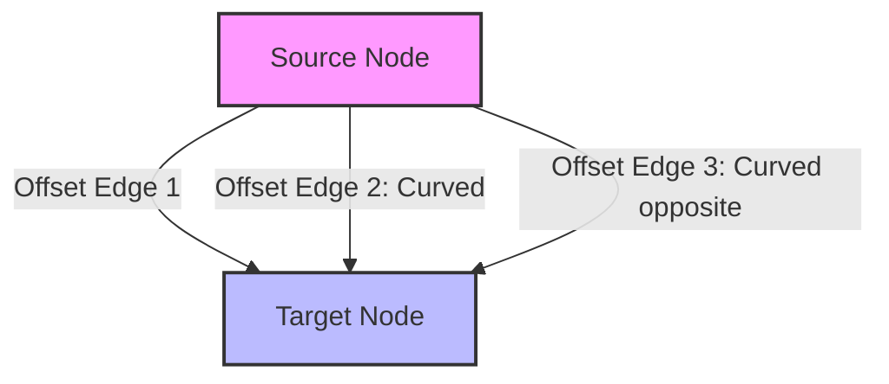
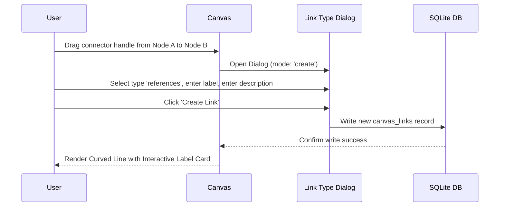

# Functional Specifications: Links & Semantic Connections in the Semantic Workbench

## 1. Executive Summary & Mission
The **Semantic Workbench** (SemanticCanvas) transitions raw information management from traditional, linear chat interfaces into a **spatial computing and knowledge synthesis engine**. Within this spatial metaphor, **Links (Connections)** are not merely visual decoration—they represent the **cognitive scaffolding** of the workspace. 

Links establish explicit, machine-readable, and human-interpretable relationships between disparate pieces of information ("Things"). This document details the exhaustive functional specifications of what can be done with links in the Semantic Workbench, spanning the visual layer, the semantic/ontology layer, cross-canvas interoperability, deep fragment-level referencing, and database architecture.

---

## 2. The Visual Layer (Canvas Connections)
The user interface renders links as interactive edges on a theoretically infinite canvas, powered by a customized implementation of **React Flow**.



### 2.1 Multi-Link Overlap Prevention (Parallel Curve Offsetting)
When users connect the same two nodes with multiple distinct relationships (e.g., Node A *triggers* Node B, and Node A *references* Node B), standard canvas renderers stack lines on top of each other, rendering them illegible. 
*   **Quadratic Bezier Offset Algorithm**: The `CustomEdge` component calculates a perpendicular direction vector relative to the line connecting the source and target.
*   **Curvature Scaling**: Each parallel edge is assigned a numeric `offset` index (0 for direct center line, positive/negative indices for outer paths). Outer lines are calculated using a quadratic control point:
    $$\text{ControlPoint} = \text{Center} + (\text{NormalVector} \times (\text{offset} \times 25\text{px}))$$
    This mathematical offsetting shifts the control points, creating a sleek, organized "rainbow" curve layout that ensures all parallel connections remain individually visible and selectable.

### 2.2 Interactive Edge Labels & Hover Micro-Animations
*   **Floating Labels**: Floating label cards are positioned dynamically at the peak coordinates of the edge path (using parameter $t = 0.25 \cdot P_0 + 0.5 \cdot P_{\text{control}} + 0.25 \cdot P_2$ for quadratic offsets).
*   **Hover & Active States**: Moving the cursor over a link scales the label slightly ($1.05\times$ zoom transition) and highlights the line stroke with the designated relationship color. Clicking the label opens the **Link Configuration & Properties** modal.
*   **Color Mapping**: Links are color-coded based on their semantic relationship type (e.g., green for `references`, red for `refutes`, purple for `derived_from`), providing immediate pre-attentive visual categorization.

### 2.3 Canvas Visibility & Decluttering Controls
To prevent "spaghetti canvas" clutter in dense knowledge structures, the Semantic Workbench provides global and local visibility filters:
*   **Global Toggle**: Instantly hides/reveals all canvas connections via a toolbar command.
*   **Selected Node Toggle**: Allows users to hide all connections except those connected to currently selected nodes, focusing on immediate local relationships.

---

## 3. The Semantic & Ontological Layer
Beyond visual layouts, links embody formal logical connections that feed into RAG (Retrieval-Augmented Generation) algorithms and graph traversals.

### 3.1 Standard Pre-configured Relationship Types
The system provides a robust set of standard, built-in predicates mapping logical and task-based relationships:

| Relationship Type | Visual Theme | Description / Use Case |
| :--- | :--- | :--- |
| **`related`** (Default) | Sleek Blue | General, unspecified relationship between two ideas. |
| **`references`** | Vibrant Green | Citing or referencing a document or external data source. |
| **`derived_from`** | Rich Purple | Node B was generated, summarized, or parsed from Node A. |
| **`contains`** | Teal Box | Hierarchical visual or logical containment. |
| **`proves`** | Sky Blue | Node A provides positive logical or empirical evidence for Node B. |
| **`refutes`** | Strong Red | Node A represents a counter-argument, contradiction, or refutation of Node B. |
| **`prerequisite`** | Bright Orange | Task-based flow indicating Node A must be completed/analyzed before B. |
| **`influences`** | Cyan | System-thinking indicator representing causation or impact. |
| **`triggers`** | Vibrant Yellow | Actionable automation link where an event in A starts execution in B. |
| **`blocks`** | Violet/Black | Critical dependency indicator showing blockage. |
| **`supersedes`** | Slate Gray | Versioning connection showing Node A replaces Node B. |

### 3.2 Scenario-Specific Dynamic Types & Ontologies
Canvases can adopt specialized **Scenarios** (domain-specific profiles like "SWOT Analysis," "Risk Management," or "System Engineering").
*   **Custom Predicates**: Scenarios inject domain-specific relationship types (e.g., a "Legal Analysis" scenario defines `governed_by` or `violates`).
*   **Visual Customization**: Scenario configurations include custom hex colors (`#6366f1`), custom icons, and user-friendly labels that override default canvas settings.
*   **Constraint Checking**: The system validates connections based on the active Scenario. For example, in an IT Strategy Scenario, the system can restrict a `Risk` node to *only* link with `Project` or `Infrastructure` nodes, preventing erroneous cross-connections.

### 3.3 ArcadeDB Graph Database Synchronization
Every connection drawn on the canvas is instantly reflected in **ArcadeDB** (the integrated Graph Database). 
*   **Semantic Graph Traversals**: Users can perform multi-hop graph queries such as: *"Find all risks associated with projects owned by Client X."*
*   **Graph-Guided Retrieval**: RAG operations query this graph to pull contextually linked documents into LLM prompt windows, vastly improving accuracy compared to simple vector keyword searches.

---

## 4. Cross-Canvas / Inter-Workspace Links
Semantic Workbench supports the concept of **Unified Link Storage**, allowing relationships to break out of a single canvas and span the entire workspace ecosystem.

```
[ Canvas A: User Research ]                     [ Canvas B: Product Roadmap ]
   +---------------------+                         +-------------------------+
   |  [Node: Persona A]  |========================>|  [Node: Feature Epic X] |
   +---------------------+  Cross-Canvas Connector +-------------------------+
```

### 4.1 Target Canvas Mapping & Properties
A single `CanvasLink` record can include a `target_canvas_id` column. When this field is populated:
*   The source node resides on the active canvas.
*   The target node resides on a completely different canvas.

### 4.2 The Cross-Canvas Selector Interface (`CrossCanvasLinkDialog`)
To establish a cross-canvas relationship, the system provides a specialized modal:
1.  **Canvas Selection Dropdown**: Dynamically queries the API (`/canvases`) for all active workspaces the current user has access to.
2.  **Live Search & Indexing**: Queries the target canvas node lists, filtering by title or type in real-time.
3.  **Visual Selection Confirmation**: Displays target nodes with their type-specific icons (e.g., Folder, PDF, Chat) and brief text previews so the user knows exactly what they are connecting to.

### 4.3 Navigational Transitions (Portal Effects)
Cross-canvas links double as **interactive portals**:
*   **Teleport Command**: Clicking on a cross-canvas link presents a *"Jump to Canvas"* action button.
*   **Refocusing Camera**: Triggering the jump automatically loads the target canvas, switches the viewport context, and animates/pans the camera view directly to center the target node on the screen.

---

## 5. Granular Deep Linking (Fragments)
A common limitation of spatial canvases is that links can only connect entire objects. The Semantic Workbench breaks this constraint with **Fragment-to-Fragment Deep Connections**, letting users link specific *sections* inside documents or nodes.

```
+--------------------------------------+           +--------------------------------------+
| Node A: Project Charter (PDF)        |           | Node B: Risk Assessment (Text)       |
|                                      |           |                                      |
|   +------------------------------+   |           |   +------------------------------+   |
|   | Region: Financial Chart      |===|===========|==>| Text: "Funding might be delayed" |   |
|   +------------------------------+   | Link ID   |   +------------------------------+   |
+--------------------------------------+           +--------------------------------------+
```

### 5.1 Fragment Types & Bounding Structures
The system recognizes three precise types of sub-node selections:
*   **Text Fragments**: Specific selected sentences, paragraphs, or words inside text nodes or document content. Mapped via character bounds:
    ```json
    { "type": "text", "content": "Funding might be delayed...", "start_offset": 1240, "end_offset": 1268 }
    ```
*   **Region Fragments**: Bounding box coordinates representing visual regions in PDFs or images (e.g., charts, architectural blueprints, tables). Mapped as relative percentages to support responsive scaling:
    ```json
    { "type": "region", "x": 15.4, "y": 42.1, "width": 50.0, "height": 22.5, "pageNumber": 3 }
    ```
*   **Message Fragments**: A specific message selected from a multi-message chat conversation node, mapped via unique database message IDs.

### 5.2 Deep-Link Anchoring Mechanics
*   **Custom Handles**: React Flow utilizes dedicated sub-handles (e.g., `fragment-handle-${link.id}`) rather than standard center handles. The link line connects directly from/to the specific visual bounding box or paragraph coordinates, making the exact contextual link point immediately obvious to the viewer.
*   **Hover Overlays**: Selecting a fragment link highlights both the source visual block (e.g., drawing a glowing yellow border around the PDF region) and the target selection block.

### 5.3 Automated Document Navigation & Zooming
Fragment connections are fully operational deep-links:
*   **Auto-Scroll & Page Navigation**: Clicking a fragment link targeting a multi-page PDF automatically tells the PDF viewer component to jump to the correct page (`pageNumber`).
*   **Cropping/Highlight Refinement**: The viewer scrolls to center the region, highlights the target text, or overlays a bounding box, ensuring the user immediately sees the exact context without manual hunting.

---

## 6. Agent & Workflow Automation Layer
Links also act as **executable pipelines** that carry data and control flow signals between autonomous AI processes.

### 6.1 Executable Blueprint Edges
Within the **Agent & Workflow Builder**, edges define the path of execution:
*   **Variable Passing**: Connections pass system variables, JSON states, or outputs from a preceding logic block into the input schema of a subsequent block.
*   **Conditional Gateways (If/Else)**: Connections act as logic paths that are traversed only if specific criteria are met (e.g., *"If sentiment score < 0.4, traverse red edge to Escalation Agent"*).

### 6.2 Spatial Drop Zones & Event Hooks
Domains (container frames) can be configured with **Drop Zones** to automate tasks when nodes are visually linked or grouped:
1.  **Drop Action**: User drops a Node (e.g., a PDF) into a domain styled as an "Automation Zone."
2.  **Event Hook Trigger**: The canvas emits an `ON_DROP` event, matching target filters (e.g., file extension `.pdf`).
3.  **Automatic Execution**: The linked Agent Blueprint is triggered, processes the PDF (e.g., running key-value extraction), and spawns a new structured text note with the output next to the original node.

---

## 7. Data & Storage Architecture

### 7.1 SQLite Application Database Schema
The primary state of canvas links is persisted in the application database (`sql_app.db`) inside the `canvas_links` table.

```sql
CREATE TABLE canvas_links (
    id VARCHAR(36) PRIMARY KEY,
    canvas_id VARCHAR(36) NOT NULL,
    source_id VARCHAR(36) NOT NULL,
    target_id VARCHAR(36) NOT NULL,
    type VARCHAR(50) NOT NULL DEFAULT 'related',
    label VARCHAR(255),
    description TEXT,
    target_canvas_id VARCHAR(36), -- Nullable, used for cross-canvas linking
    source_fragment JSON,         -- Nullable, stores source fragment bounding data
    target_fragment JSON,         -- Nullable, stores target fragment bounding data
    created_at TIMESTAMP DEFAULT CURRENT_TIMESTAMP,
    FOREIGN KEY (canvas_id) REFERENCES canvases(id) ON DELETE CASCADE
);
```

#### Key Architecture Strengths:
1.  **Cascade Delete Integrity**: The table utilizes Foreign Key cascades on the `canvas_id`. If a canvas is deleted, all associated links are cleaned up instantly to prevent database bloat.
2.  **Flexible JSON Columns**: `source_fragment` and `target_fragment` use native SQLite JSON columns. This allows the backend to dynamically handle diverse schemas (PDF regions, text characters, or conversation indices) without rigid columns.
3.  **Unified Cross-Canvas Column**: The inclusion of `target_canvas_id` allows single queries to check for external relations, enabling fast loading of inter-canvas dependency maps.

---

## 8. User Experience & Interface Walkthrough



### 8.1 Creating a Relationship
1.  **Drawing the Line**: The user hovers over a node to reveal connection anchors, clicks and drags a connector line, and drops it onto the target node.
2.  **Defining Semantics**: Upon dropping, the **Link Type Dialog** pops open. The user selects from standard configurations (e.g., `references`, `supersedes`) or scenario types, types a mandatory short label (e.g., *"supersedes V1"*), and writes a mandatory explanation.
3.  **Persistence**: Clicking *"Create"* pushes the record to the backend SQL database and notifies the ArcadeDB graph database.

### 8.2 Interacting with Existing Connections
1.  **Detailed Panel**: Clicking a link highlights the edge and opens the inspector panel on the right, showing creation date, relationship type, and the full description context.
2.  **Modifying Relationships**: Users can click *"Edit"* in the inspector or double-click the label to re-open the Dialog, change the relationship type, update the text description, or delete the link entirely.
